<!--
theme: gaia
style: |
    /*
    * @theme enable-all-auto-scaling
    * @auto-scaling true
    */
    /* @theme marpit-theme */
    section {
      font-size: 30px;
      padding: 50px;
    }
    section.lead h2 {
      font-size: 30px;
      text-align: center;
    }
    img[alt~="center"] {
      display: block;
      margin: 0 auto;
    }

size: 4K
headingDivider: 2 
paginate: false
-->

<!--
_class:
 - lead
 - invert
-->

# Observability Journey

@ddiiwoong

## Who am I?

- **김진웅**
- **@ddiiwoong**
- **Cloud Architect (Generalist), Speaker, Translator**
- **https://ddii.dev**

## Monitoring

#### Google's Site Reliability Engineering (SRE) book
- 시스템이 정상적으로 동작하는지?

- 쿼리 카운트, 에러 카운트, 처리 시간, 서버의 활성 시간과 같은 시스템에 관련된 정량적 수치를 실시간으로 수집, 처리, 집계, 보여주는 모든 행위 
  - Signal, Log, Telemetry, Trace 등을 수집하고 집계하는 행위
  - 임계점을 넘어가는 상태에 대한 알림 및 조치
예) DB Connection Pool 초과시 알람 발생 및 통지 -> Conncetion Pool tunning

## What is Observability?

### **Observability(관측가능성, 관찰가능성)**
- 왜 정상적으로 동작하지 않는지?

- 도구(tools)들을 통해 시스템과 애플리케이션에서 발생하는 문제를 파악하는 것  

- 원격측정(Telemetry) Data
  - Logs: 타임스탬프 메세지로 나타내는 시스템 이벤트, 상태
  - Metrics : 키-밸류 태그를 가지는 집계/통계 데이터 (Gauge, Counter, Histogram 등)
  - Traces : 개별 Request가 전체 시스템에 전파(propagate)될 때 경로에 대한 기록  

- 관찰가능성은 예측 불가능한 모든 장애 가능성을 알 수 없다는 것을 전제로 함
  예) 데이터베이스에 관련된 인프라 홉과 같은 요청 경로를 추적하고 특정 사용자 및 요청에 대해 데이터베이스 쿼리가 실행된 수준까지 파악하는 것

## 관찰가능성 확보

관찰가능성 확보를 위해서는 세밀한(High Resolution) **데이터**가 필요함

집계(Aggregation)보다 중요한건 수집된 **데이터**를 분석하는 능력

문제(장애) 발생시 필요한건 고해상도(high resolution) 메트릭(Metrics), 로그(Log), 트레이스(Trace) **데이터** 수집과 탐색 도구

# Metrics
<!--
_class:
 - lead
 - invert
-->

## 메트릭(Metrics)

응용 프로그램 및 서비스의 성능과 품질을 측정하는 데 도움이 되는 정량 데이터
- Database 및 API의 Latency
- Request content length
- open file descriptor 수
- cache hit/miss 수

## 메트릭 수집 방식 (Push)
### **Push**
- 모니터링 주체가 서버에 정보를 보냄
- 수집 서버 정보를 알아야함
- 버퍼링 메커니즘(queue)
- 구성관리도구(CMDB) 필요
- 메트릭 정보가 변경될때 마다 일괄 배포
예) TICK Stack, Nagios
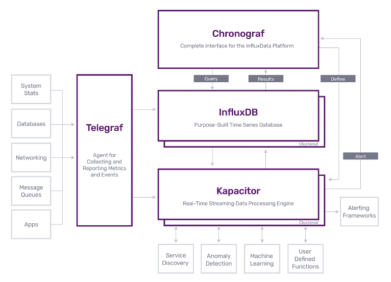


## 메트릭 수집 방식 (Pull)
### **Pull**
- Exporters (like agent)
- 수집 서버 정보 모름
- 서버에서 필요한 메트릭을 수집
- Service Discovery
- Push 방식도 지원 (Pushgateway)
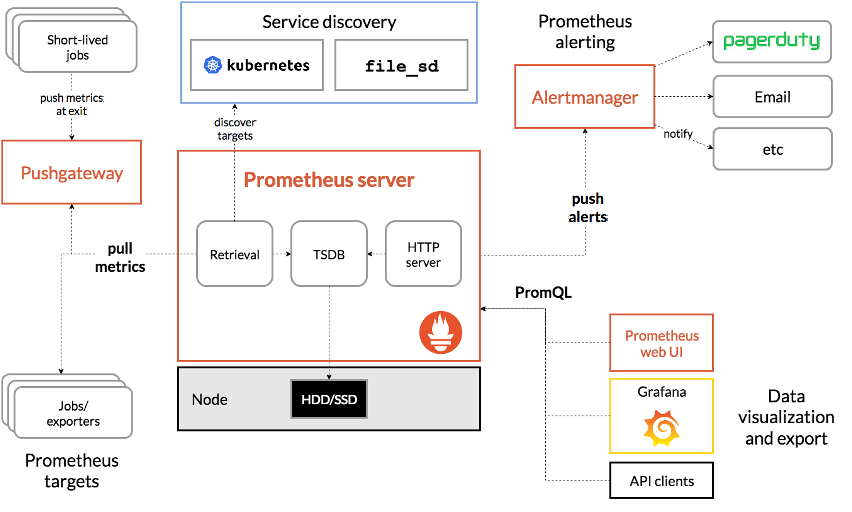

<!-- _footer: "출처 : https://www.influxdata.com/time-series-platform/" -->

## Prometheus

- 그리스 신화 티탄족(Titan) 신
- 선지자(先知者) - 먼저 생각하는 사람
- 능력 : **예지** 능력
- 제우스의 불을 훔쳐 인간에게 전해줌
- 인간이 신의 지식을 얻어 각성
- “판도라의 상자”


<!-- _footer: "출처 : https://philamuseum.org/collection/object/104468" -->

## Prometheus

### Metric Collector + Metric Database

- SoundCloud in 2012
First Release of v1 in 2016
- CNCF 2nd Graduated Project in 2018
  - Retrieval Worker (Pull/Scrape/Push)
  - TSDB
  - Simple Web Interface (React)
  - Service Discovery
  - Alerting (email, slack, pageduty, opsgenie)
  - Performance


<!-- _footer: "출처 : https://prometheus.io/docs/introduction/overview/" -->

## Prometheus Component


## Prometheus Metrics 

**Lables : multi-dimensional data (Key-Value)**

```js
<metric name>{<label name>=<label value>, ...} <metric value>
```


## Prometheus Metrics (Metadata)

상대적으로 사람이 쉽게 이해할만한 표현 형식 (metadata, metric)
- HELP : 메트릭 이름, 간단한 설명
- TYPE : 메트릭 데이터 타입 (summary, gauge, counter, histogram, untyped)


## Prometheus Metrics (Counter)
#### **카운터(Counter) : 누적 메트릭 타입**
- scrape이 실패하더라도 누적된 증가치는 손실되지 않고 다음 scrape을 통해 확인가능
- rate(), irate()를 통한 추이 분석 활용
- 인스턴스의 재시작 등을 통한 카운터 초기화 시 데이터 손실


## Prometheus Metrics (Gauge)
#### **게이지(Gauge)**
- 측정값을 스냅샷(snapshot)하는 메트릭으로 실시간 메트릭(온도, 사용량)에 유용
- scrape이 실패하면 다음 scrape에는 다른 값의 메트릭 수집, 손실 발생 가능


## Prometheus Metrics (Histogram)
#### **히스토그램(Histogram)**
- 버킷(bucket)별 분위수(quantile) 집계 
- 구간별 데이터 분포도 파악, 히트맵 생성
- histogram_quantile() 활용
- 기본적으로 Counter
- TPS, 특정 기간 동안 API Call 수

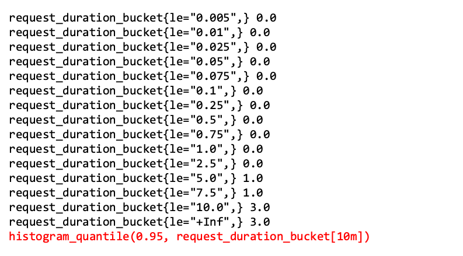

## Prometheus Metrics (Summary)

#### **서머리(Summary)**
- 클라이언트에서 분위수(quantile) 계산 하므로 인스턴스에서 집계 불가
- 히스토그램보다 정확하지만 계산 비용 발생
- 특정 기간동안의 집계나, Request duration, response size 등을 모니터링

```js
request_duration_summary{quantile="0.95",} 7.4632192
request_duration_summary_count 5.0
request_duration_summary_sum 27.338737899999998
```

## Prometheus PromQL

메트릭을 검색(retrive)하기 위한 고유한 쿼리 언어(Query Language)


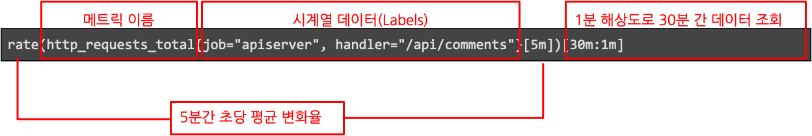

## Prometheus Jobs & Instances

- Instance : single unit/process(ex:서버 단위, CPU 사용량)
- Job : Collection of Instances


## Expression Language Data Types

데이터를 표시하기 위한 네가지 타입

- 인스턴트 벡터(Instant vector) : RE2 syntax, 연산자(operator), 레이블 매처(matcher)
  ```js
  http_requests_total{environment=~"staging|testing|development",method!="GET"}
  ```
- 레인지 벡터(Range vector)  :  초(s), 분(m), 시간(h), 일(d), 주(w), 연(y) 단위로 사용
  ```js
  http_requests_total{code="200"}[1m]
  ```
- 스칼라(Scalar)
	차원없이 숫자(floating point value)로 구성된 값
- 문자열(String)
	현재 미사용

## Expression Language Data Types

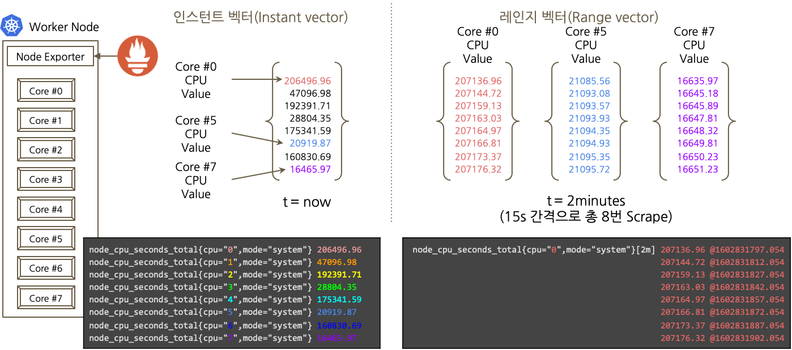

## Metric Collections

**Scrape(스크랩)**
- Pulling time-series data

**Metric Source**
- Directly : Metric endpoint
- Exporter : Official & 3rd Party
  https://prometheus.io/docs/instrumenting/exporters/

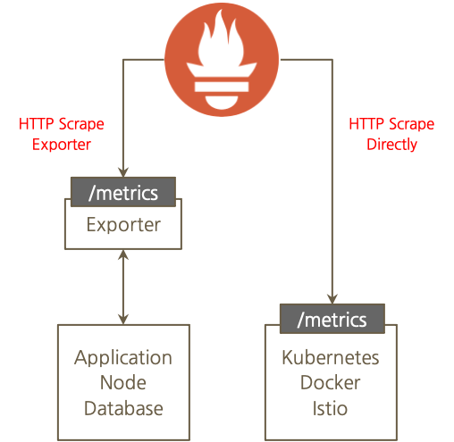

## Metric Collections

Client Library
- Go, Java(Scala), Python, Ruby (Official)
- 3rd Party Library (https://prometheus.io/docs/instrumenting/clientlibs/)


Example - Python
```python
from prometheus_client import start_http_server, Summary
import random
import time

# Create a metric to track time spent and requests made.
REQUEST_TIME = Summary('request_processing_seconds', 'Time spent processing request')
```

## Prometheus Exporter
**Exporter**
- https://prometheus.io/docs/instrumenting/exporters/ 
- 코드를 직접 수정할수 없는 패키징 소프트웨어 메트릭이 노출시킬때 사용
- 네트워크, 스토리지, 데이터베이스 솔루션 또는 시스템 계측 시
- Official Exporter
  - Consul, Memcached, MySQL, Node(System), HAProxy
  - AWS CloudWatch, Collectd, Graphite, InfluxDB, JMX, SNMP, StatsD
  - Blackbox
- 3rd Party Exporter
  - Nginx, MongoDB, PostgreSQL, Redis, ElasticSearch, IPMI, Windows

## Prometheus Pushgateway

**Pushgateway** 

https://github.com/prometheus/pushgateway

- 애플리케이션 또는 서비스에서 직접 메트릭을 Push하는 API제공
- Push방식을 완벽하게 지원 X
- 언제 끝날지 모르는 짧은 주기의 Batch Job등 특정 시점 scrape이 불가능한 환경
- firewall/NAT 로 인해 네트워크가 분리된 경우 - PushProx 적용 검토
  - https://github.com/prometheus-community/PushProx

## Prometheus Metric Target

- Static Target 
  - Application Library, Pushgateway
- Service Discovery 
  - File-based Discovery
  - Automated Discovery (DNS, Consul, Cloud Provider, Kubernetes...)


## Prometheus Alertmanager

Prometheus 
- Alert Rules setting
- Alert Trigger

Alertmanager
- Notification Channel Integration
- Send to Notification Channel
- Alert De-Duplication
- Alert Routing
- Silence  

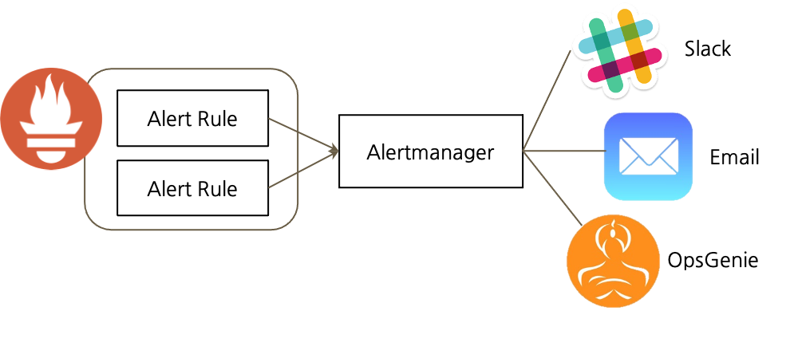

## Metrics Visualization

Grafana Dashboard - https://grafana.com/grafana/dashboards

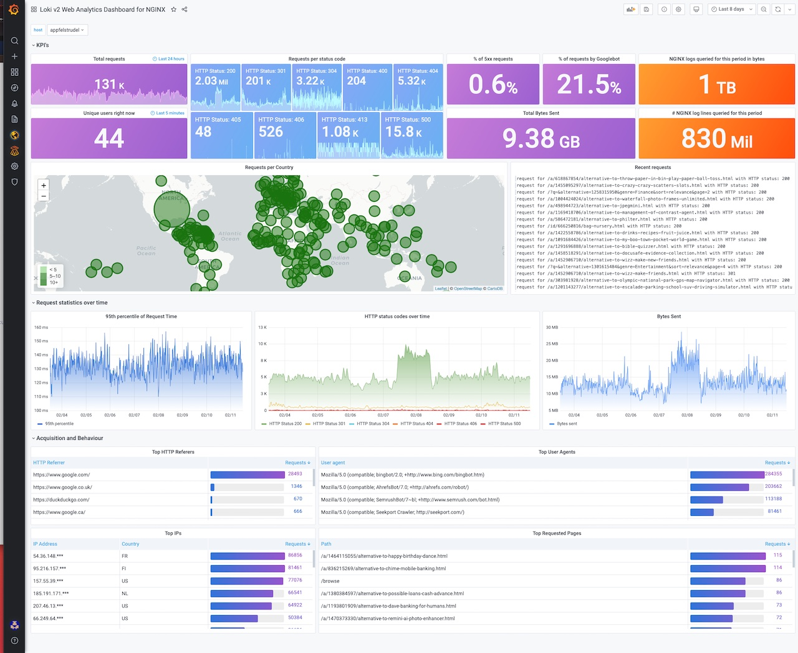

<!-- _footer: "출처 : https://grafana.com/grafana/dashboards/12559" -->


## Prometheus Constraints

- 원시 로그 / 이벤트 수집 : Loki, Elastic Stack
- 요청 추적(Request Tracing) : OpenTelemetry
- 이상 감지(Anomaly Detection)
- 장기 보관 및 고가용성 (Long-term Storage, HA)
- 스케일링(horizontal scaling)
- 사용자 인증 관리

## Books


# Traces
<!--
_class:
 - lead
 - invert
-->

## Distributed Trace (분산 추적)

- 시스템의 프로세스에서 특정 부분의 지연(latency)을 알려주는 원격 측정(telemetry)방법

- 요청(Requests)이 마이크로서비스 및 서버리스 아키텍처를 통해 전파될때 이동하는 경로를 기록

- 마이크로서비스 환경같은 최신 아키텍처에서 수많은 구성 요소간의 종속성과 관계를 측정하고 지연 병목을 찾아내는 도구이기 때문에 Observability에서 매우 중요

## What is OpenTelemetry?

**OpenTelemetry https://opentelemetry.io/**

Observability에 필요한 telemetry 데이터(Logs, Metrics, Traces)를 계측(instrumentation)하고 내보내기(export)하는 SDK, Specification 등의 도구(Tools)

- Kubernetes 다음 가장 활발한 CNCF 프로젝트
- Open Standard, 커뮤니티 주도 Sandbox 프로젝트 by **CNCF**
- 라이브러리를 사용해서 고해상도(high-quality),벤더 중립적인(Agnostic) 방식으로 다양한 아키텍처의 애플리케이션 계측

## Ecosystem

- 지원 언어 - **Go**, **JavaScript**, **Java**, **Python**, Ruby, C++, Rust, PHP, etc...
- 호환 : Jaeger, Fluentbit, Prometheus, Kubernetes
- Contribute
  - AWS, Azure, GCP
  - Lightstep, Datadog, Dynatrace, honeycomb, NewRelic, Splunk, Stackdriver
  - Mailchimp, Shopify

## Why OpenTelemetry?

#### Simple Microservices

 

## Why OpenTelemetry?

#### Real World is 


## Context Propagation

### Core Concept : 서비스간 트레이스 전달 규약 (W3C, Zipkin B3)

 

## Traces

- Trace : 서비스 요청에 대한 애플리케이션 또는 서비스 구조 확인하고, 모든 서비스들 간 데이터 흐름을 시각화하여 아키텍처상의 병목 현상을 파악 
- Span : 다양한 정보를 캡슐화(encapsulate)

<!-- 쉽게 설명하면 마이크로서비스에서 각각의 서비스를 span이라고 가정하면, span간 연결되는 점선을 trace의 context를 나타냅니다. 각 context에는 프로세스 내부의 function 또는 RPC를 통해 전달되는 여러가지 정보들이 담겨있습니다. 

span context 이외에도 뒤에서 설명할 trace와 span의 parent 식별자(id)와 prometheus와 유사하게 custom label로 process 및 request 관련 정보들을 담을수 있습니다. -->
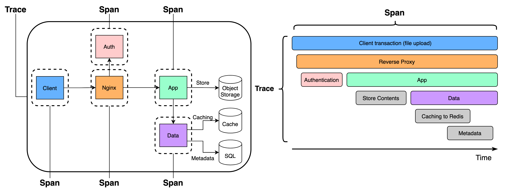

## Spans
  - Name, Timestamp (start, finish) 
  - Attributes : 자유롭게 추가가능한 키-밸류 (Customer ID, Version, Host ID 등)
  - Events : 타임스탬프 문자열(String) 형태의 tuple (name, timestamp, attributes)
  - Links : Span의 인과 관계 
  - SpanContext : Span이 참조하는데 필요한 정보
    - TraceId : Worldwide 식별자 (16 bytes array identifier) 
    - SpanId(ParendId) : Globally in a service (8 bytes array identifier)
    - TraceFlags : Optional, Sampling bit (1 byte(8 bit), but only 1 bit used) 
    - Tracestate : Optional 키-밸류 (예, 벤더 식별 정보)

## W3C Trace Context
#### Trace Context :https://w3c.github.io/trace-context/
- 상관(Correlation) 정보 (요청에 대한 식별자 및 구성 요소 간의 parent-child 관계)에 대한 전달 방법에 대한 표준
  - traceparent : trace-id(TraceId), span-id(SpanId), sampling flag(TraceFlags)
  - tracestate
#### Baggage : https://w3c.github.io/baggage/
-  메트릭, 추적 및 로그에 사용자가 원하는 컨텍스트와 정보를 추가하는 데 사용
   -  baggage: userId=alice, baggage: serverNode=node01

## Passing Context


## Client Architecture

#### Client Types


#### Client Data Pipeline


## Collector Architecture


<!-- _footer: "출처 : https://opentelemetry.io/docs/collector/" -->

## Collector Pipeline


# Demo
<!--
_class:
 - lead
 - invert
-->

## Demo Applications

- https://github.com/jinwoongk/nginx-springboot-observability/

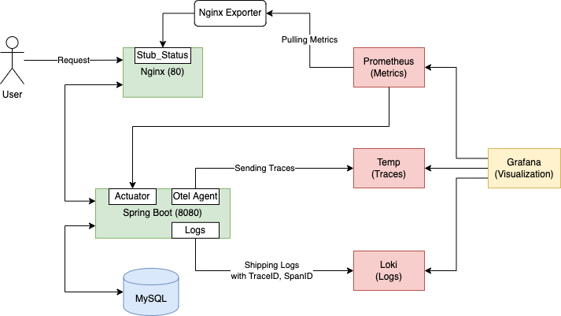


## Demo - Nginx Configuration

```properties
http {
    upstream backend {
        zone name 10m;
        server hello-observability:8080;
    }
    server {
        listen 80 default_server;
        server_name _;
...
        location /stub_status {
            stub_status on;
        }
        location /api {
            api write=on;
        }
        location / { 
            proxy_pass http://backend;
        }
...
```

## Demo - Nginx stub_status

Nginx OSS - http://nginx/stub_status
<!-- Nginx Plus -http://nginx/api -->

## Demo - Nginx Exporter

http://nginx-exporter:9113/metrics 에서 nginx metrics 확인

```properties
# HELP nginx_connections_accepted Accepted client connections
# TYPE nginx_connections_accepted counter
nginx_connections_accepted 20
# HELP nginx_connections_active Active client connections
# TYPE nginx_connections_active gauge
nginx_connections_active 1
# HELP nginx_connections_handled Handled client connections
# TYPE nginx_connections_handled counter
nginx_connections_handled 20
# HELP nginx_connections_reading Connections where NGINX is reading the request header
# TYPE nginx_connections_reading gauge
nginx_connections_reading 0
# HELP nginx_connections_waiting Idle client connections
# TYPE nginx_connections_waiting gauge
nginx_connections_waiting 0
# HELP nginx_connections_writing Connections where NGINX is writing the response back to the client
# TYPE nginx_connections_writing gauge
nginx_connections_writing 1
```
<!-- 
## Demo - Nginx Plus Exporter

http://nginx-exporter:9113/metrics 에서 nginx plus metrics 확인

```properties
# HELP nginxplus_connections_accepted Accepted client connections
# TYPE nginxplus_connections_accepted counter
nginxplus_connections_accepted 88
# HELP nginxplus_connections_active Active client connections
# TYPE nginxplus_connections_active gauge
nginxplus_connections_active 1
# HELP nginxplus_http_requests_current Current http requests
# TYPE nginxplus_http_requests_current gauge
nginxplus_http_requests_current 1
# HELP nginxplus_http_requests_total Total http requests
# TYPE nginxplus_http_requests_total counter
nginxplus_http_requests_total 539 -->
```

## Java Metrics

Exporter, Client Library 형태로 메트릭 수집

- https://github.com/prometheus/jmx_exporter
- https://github.com/prometheus/client_java

SLF4J 와 유사한 방법으로 Micrometer 를 사용

- https://micrometer.io/

## Java Dependencies (Maven)

pom.xml
```xml
<dependency>
    <groupId>org.springframework.boot</groupId>
    <artifactId>spring-boot-starter-actuator</artifactId>
</dependency>
 
<dependency>
    <groupId>io.micrometer</groupId>
    <artifactId>micrometer-registry-prometheus</artifactId>
    <scope>runtime</scope>
</dependency>
```

## Java Dependencies (Gradle)

build.gradle
```js
dependencies {
  ...
  implementation "org.springframework.boot:spring-boot-starter-actuator"
  implementation "io.micrometer:micrometer-registry-prometheus:latest.release"
  ...
}
```

## Demo - Java Properties

application.properties
```properties
# Logging
logging.file.name=/tmp/hello-observability.log
logging.level.org.springframework=INFO
logging.level.org.springframework.web.filter.CommonsRequestLoggingFilter=DEBUG
logging.pattern.file=%d{yyyy-MM-dd HH:mm:ss} - %logger{36} - %msg traceID=%X{trace_id} %n

# JMX
management.endpoints.web.exposure.include=health,metrics,prometheus
management.metrics.tags.application=${spring.application.name}
management.health.probes.enabled=true
management.endpoint.health.show-details=always
```

## Demo - Java Environment (Auto)

Environment in Dockerfile
```dockerfile
FROM adoptopenjdk/openjdk11
CMD ["./mvnw", "clean", "package"]

ADD https://github.com/aws-observability/aws-otel-java-instrumentation/releases/latest/download/aws-opentelemetry-agent.jar \
    /opt/aws-opentelemetry-agent.jar
ENV JAVA_TOOL_OPTIONS=-javaagent:/opt/aws-opentelemetry-agent.jar

ARG JAR_FILE_PATH=target/*.jar
COPY ${JAR_FILE_PATH} app.jar
ENTRYPOINT ["java", "-jar", "app.jar"]
```

## Demo - Java Environment (Manual)

```java
public List<Flight> getFlights(String origin) {
    LOGGER.info("Getting flights for {}", origin);
    List<Flight> flights = this.flightClient.getFlights(origin);
    doSomeWorkNewSpan();
    return flights;
}

@WithSpan
private void doSomeWorkNewSpan() {
    LOGGER.info("Doing some work In New span");
    Span span = Span.current();
    span.setAttribute("attribute.a2", "some value");
    span.addEvent("app.processing2.start", atttributes("321"));
    span.addEvent("app.processing2.end", atttributes("321"));
}

private Attributes atttributes(String id) {
    return Attributes.of(AttributeKey.stringKey("app.id"), id);
}
```

## JVM Metrics

http://hello-observability:8080/actuator/prometheus 에서 JVM metrics 확인

```
...
# HELP jvm_memory_usage_after_gc_percent The percentage of long-lived heap pool used after the last GC event, in the range [0..1]
# TYPE jvm_memory_usage_after_gc_percent gauge
jvm_memory_usage_after_gc_percent{application="hello-observability",area="heap",pool="long-lived",} 0.01688990317100336
# HELP jvm_gc_max_data_size_bytes Max size of long-lived heap memory pool
# TYPE jvm_gc_max_data_size_bytes gauge
jvm_gc_max_data_size_bytes{application="hello-observability",} 2.283798528E9
# HELP executor_pool_max_threads The maximum allowed number of threads in the pool
# TYPE executor_pool_max_threads gauge
executor_pool_max_threads{application="hello-observability",name="applicationTaskExecutor",} 2.147483647E9
# HELP jvm_memory_used_bytes The amount of used memory
# TYPE jvm_memory_used_bytes gauge
jvm_memory_used_bytes{application="hello-observability",area="nonheap",id="Metaspace",} 1.1375316E8
jvm_memory_used_bytes{application="hello-observability",area="heap",id="G1 Old Gen",} 3.8573136E7
jvm_memory_used_bytes{application="hello-observability",area="nonheap",id="CodeHeap 'non-nmethods'",} 1463552.0
jvm_memory_used_bytes{application="hello-observability",area="heap",id="G1 Eden Space",} 6.7108864E7
jvm_memory_used_bytes{application="hello-observability",area="nonheap",id="CodeHeap 'profiled nmethods'",} 3.8239488E7
jvm_memory_used_bytes{application="hello-observability",area="heap",id="G1 Survivor Space",} 1.048576E7
jvm_memory_used_bytes{application="hello-observability",area="nonheap",id="CodeHeap 'non-profiled nmethods'",} 1.2258176E7
jvm_memory_used_bytes{application="hello-observability",area="nonheap",id="Compressed Class Space",} 1.3920448E7
...
```

## Prometheus Target Discovery

Scrape Static Targets

```
  - job_name: nginx
    static_configs:
    - targets: ['nginx-exporter:9113']

  - job_name: actuator
    metrics_path: /actuator/prometheus
    static_configs:
    - targets: ['hello-observability:8080']
```

## Visualization

**Grafana Dashboard**

NGINX - https://grafana.com/grafana/dashboards/12708-nginx/
<!-- NGNIX Plus - https://grafana.com/grafana/dashboards/12930-nginx/ -->
JVM - https://grafana.com/grafana/dashboards/4701-jvm-micrometer/


## Tracing

Tempo Tracing


## References
- https://github.com/prometheus/prometheus
- https://github.com/grafana/tempo
- https://github.com/grafana/loki
- https://github.com/grafana/grafana
- https://github.com/open-telemetry/opentelemetry-java-instrumentation
- https://github.com/nginxinc/nginx-prometheus-exporter
- https://github.com/ddiiwoong/nginx-hello-stub
- https://github.com/adamquan/hello-observability
- https://github.com/observabilitystack/o11y-workshop


# Summary
<!--
_class:
 - lead
 - invert
-->

## 트러블슈팅 워크플로우

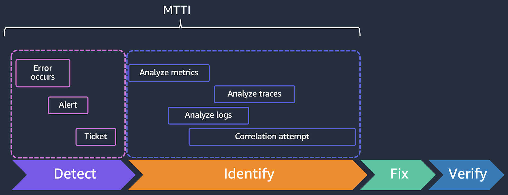

<!-- _footer: "출처 : AWS Observability Workshop" -->

## 관찰가능성 성숙도


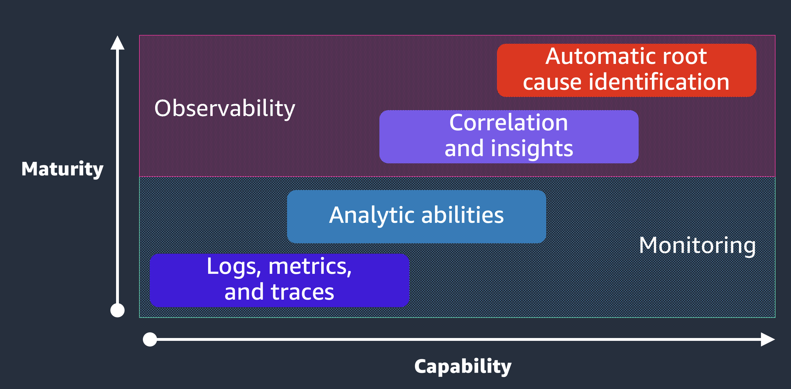

<!-- _footer: "출처 : AWS Observability Workshop" -->

## Good Observability (Technical)

#### **Good data can help with the cultural shift to new systems**

- Improved debugging and troubleshooting
- Reducing MTTD and MTTR
- Designs validated with data
- Reduced defects; more issues caught proactively
- Improved feature velocity

<!-- _footer: "출처 : AWS Observability Workshop" -->

## Good Observability (Cultural)

#### **Good data can help with the cultural shift to new systems**

- Builds transparency across teams
- Shared understanding of complex components
- Decisions not (entirely) driven or explained by gut feelings or guessing
- Freedom to experiment
- Blameless culture
- Context not control 

<!-- _footer: "출처 : AWS Observability Workshop" -->

# Thank You
<!--
_class:
 - lead
 - invert
-->